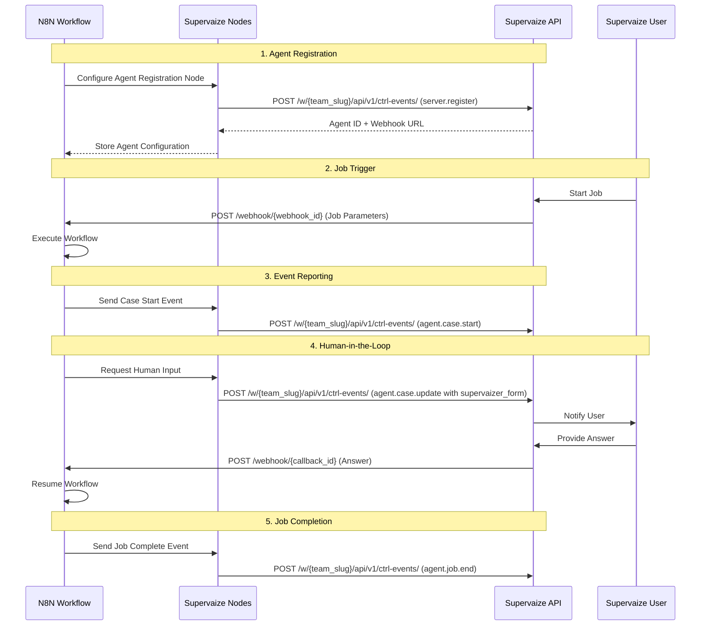

| 📄 Document  | N8N Supervaizer Requirements                                             |
| ------------ | ------------------------------------------------------------------------ |
| 🏢 Project   | n8n-supervaizer                                                          |
| ✍️ Author    | ALP + AI Assistant                                                       |
| 🗓️ Date      | 2025-11-27                                                               |
| 🏷️ Version   | v1.0                                                                     |
| 🛠️ Status    | Requirements Specification                                               |
| 📚 Reference | [N8N Community Nodes](https://docs.n8n.io/integrations/community-nodes/) |
|              | [Supervaize Application](../../supervaize)                               |
|              | [Python Supervaizer](../../supervaizer)                                  |

---

## Table of Contents

- [Overview](#overview)
- [Architecture](#architecture)
- [Package Structure](#package-structure)
- [Node 1: Supervaize Agent Registration](#node-1-supervaize-agent-registration)
- [Node 2: Supervaize Trigger](#node-2-supervaize-trigger)
- [Node 3: Supervaize Event](#node-3-supervaize-event)
- [Node 4: Supervaize Human-in-the-Loop](#node-4-supervaize-human-in-the-loop)
- [Security Considerations](#security-considerations)
- [API Endpoints Required](#api-endpoints-required)
- [Data Models](#data-models)
- [Testing Requirements](#testing-requirements)
- [Documentation Requirements](#documentation-requirements)
- [Deployment](#deployment)

---

## Overview

The **@supervaize/n8n-nodes-supervaizer** package provides official integration between Supervaize and n8n.

We are creating a new N8N node, according to the [N8N documentation](https://docs.n8n.io/integrations/community-nodes/).

Note : **supervaize** is the name of the saas platform. **supervaizer** is the name of the controller. We already have a python controller (see https://github.com/supervaize/supervaizer). We are now creating the N8N controller.

Main objectives:

1. **Register an n8n workflow as a Supervaize Agent**
   - Use Supervaize URL + workspace + API key
   - Optionally delegate secret management to Supervaize via `AgentParametersSetup`
   - Share `AgentMethodsModel` so Supervaize knows which method/fields start the n8n job
2. **Start a workflow FROM a Supervaize Job**
   - Node exposes a webhook URL that Supervaize calls when a job is started
   - Supervaize POSTs job context, job fields, and (optionally) agent parameters
   - The n8n workflow is started only when parameters are valid
3. **Send Supervaize events from inside the n8n workflow**
   - Create/update **Cases**
   - Push **CaseNodeUpdate**-style updates
   - Update overall job status and summary
4. **Allow Supervaize to query or reflect job status**
   - N8N can push explicit job status updates
5. **Support Human-in-the-Loop (HITL)**
   - N8N requests human input via a Supervaize event
   - Supervaize collects the human response in Studio
   - Supervaize calls back into n8n to resume the workflow
6. **Allow Supervaize to stop an n8n workflow**
   - Supervaize sends a command to a dedicated webhook
   - N8N uses that message to cancel or mark the execution as stopped

### 1. Supervaize Agent Registration (Action Node)

**Purpose**: Registers the n8n workflow as an Agent in Supervaize.

**Functionality**:

- Sends agent metadata (name, description, slug) to Supervaize.
- Sends method definitions (`AgentMethodsModel`) to Supervaize.
- Sends parameter definitions (`AgentParameterSetup`) to Supervaize.
- **Computes and sends Webhook URLs**:
  - Job Start URL: `/webhook/supervaize/job-start/<agentSlug>`
  - Command URL (Stop/Resume): `/webhook/supervaize/command/<agentSlug>`
- **Output**: Returns `agent_id` and `webhook_secret`.

### 2. Supervaize Trigger (Webhook Node)

**Purpose**: Starts the workflow when a Job is initiated in Supervaize.

**Functionality**:

- Listens on `/webhook/supervaize/job-start/<agentSlug>`.
- Validates `X-Supervaize-Signature` header.
- Parses job context, variables, and parameters.
- **Output**: `job_id`, `job_variables`, `agent_parameters`, `context`.

### 3. Supervaize Command Trigger (Webhook Node)

**Purpose**: Listens for control commands from Supervaize (e.g., Stop Job, Resume HITL).

**Functionality**:

- Listens on `/webhook/supervaize/command/<agentSlug>`.
- Validates `X-Supervaize-Signature`.
- Handles `stop` commands to cancel execution.
- Handles `human_input` callbacks to resume execution.
- **Output**: `command`, `payload` (e.g., user answers).

### 4. Supervaize Event (Action Node)

**Purpose**: Sends events to Supervaize to report progress.

**Operations** (Mapped to Backend Events):

- `Job Start Confirmation` -> `agent.job.start.confirmation`
- `Case Start` -> `agent.case.start`
- `Case Update` -> `agent.case.update` (used for both progress updates and human-in-the-loop questions)
- `Case End` -> `agent.case.end`
- `Job End` -> `agent.job.end`
- `Human Input Request` -> `agent.case.update` (with `supervaizer_form` in payload)

### 5. Supervaize Human-in-the-Loop (Wait Node Wrapper)

**Purpose**: Helper node to simplify the HITL flow.

**Functionality**:

- Uses `Supervaize Event` to send `Human Input Request`.
- Uses n8n's `Wait` node functionality to pause execution.
- Resumes when `Supervaize Command Trigger` receives the answer.mmunity Node Package

**License**: MIT (or as per Supervaize licensing)

**Repository**: `https://github.com/supervaize/n8n-nodes-supervaizer`

**npm Package**: `@supervaize/n8n-nodes-supervaizer`

**Note**: The package name follows the pattern `@supervaize/n8n-nodes-supervaizer` (npm) and repository `n8n-nodes-supervaizer`.

---

## Architecture

### High-Level Flow



### Component Diagram

```
┌─────────────────────────────────────────────────────────────┐
│                    N8N Workflow                             │
│                                                             │
│  ┌──────────────────┐  ┌──────────────────┐               │
│  │  Supervaize      │  │  Supervaize      │               │
│  │  Agent           │  │  Trigger         │               │
│  │  Registration    │  │  (Webhook)       │               │
│  └────────┬─────────┘  └────────┬─────────┘               │
│           │                     │                          │
│  ┌────────▼─────────┐  ┌────────▼─────────┐               │
│  │  Supervaize      │  │  Supervaize      │               │
│  │  Event           │  │  Human-in-Loop   │               │
│  │  (Send Events)   │  │  (Wait/Resume)   │               │
│  └────────┬─────────┘  └────────┬─────────┘               │
│           │                     │                          │
└───────────┼─────────────────────┼──────────────────────────┘
            │                     │
            ▼                     ▼
┌─────────────────────────────────────────────────────────────┐
│              Supervaize API (Django Backend)                │
│                                                             │
│  ┌───────────────────────────────────────────────────────┐  │
│  │             Controller Events API                     │  │
│  │   (Unified Ingestion for Agents, Jobs, Cases)         │  │
│  └──────────────────────────▲────────────────────────────┘  │
│                             │                               │
│                             │ POST /api/v1/ctrl-events/     │
│                             │                               │
│  ┌──────────────────────────┴────────────────────────────┐  │
│  │             N8N Integration Module                    │  │
│  └───────────────────────────────────────────────────────┘  │
│                                                             │
│  ┌──────────────┐  ┌──────────────┐  ┌──────────────┐     │
│  │  Webhooks    │  │  Parameters  │  │  Job Stop    │     │
│  │  Management  │  │  Management  │  │  Control     │     │
│  └──────────────┘  └──────────────┘  └──────────────┘     │
└─────────────────────────────────────────────────────────────┘
```

---

## Package Structure

```
n8n-nodes-supervaize/
├── package.json
├── tsconfig.json
├── README.md
├── LICENSE
├── .gitignore
├── nodes/
│   ├── Supervaize/
│   │   ├── SupervaizeAgentRegistration.node.ts
│   │   ├── SupervaizeAgentRegistration.node.json
│   │   ├── SupervaizeEvent.node.ts
│   │   ├── SupervaizeEvent.node.json
│   │   └── supervaize.svg (icon)
│   └── SupervaizeTrigger/
│       ├── SupervaizeTrigger.node.ts
│       ├── SupervaizeTrigger.node.json
│       └── SupervaizeHumanInLoop.node.ts
├── credentials/
│   ├── SupervaizeApi.credentials.ts
│   └── SupervaizeApi.credentials.json
├── utils/
│   ├── SupervaizeApiClient.ts
│   ├── types.ts
│   └── constants.ts
├── test/
│   ├── SupervaizeAgentRegistration.test.ts
│   ├── SupervaizeTrigger.test.ts
│   └── SupervaizeEvent.test.ts
└── docs/
    ├── setup-guide.md
    ├── examples/
    │   ├── basic-agent.json
    │   ├── human-in-loop.json
    │   └── multi-case-workflow.json
    └── api-reference.md
```

---

## Node 1: Supervaize Agent Registration

### Purpose

Registers the n8n workflow as an agent in Supervaize, configuring parameters and methods that the agent supports.

### Node Type

**Regular Action Node** (not a trigger)

### Configuration Fields

#### Connection Settings

| Field           | Type       | Required | Description                                                  |
| --------------- | ---------- | -------- | ------------------------------------------------------------ |
| `supervaizeUrl` | String     | Yes      | Supervaize instance URL (e.g., `https://app.supervaize.com`) |
| `workspaceSlug` | String     | Yes      | Workspace/Team slug                                          |
| `apiKey`        | Credential | Yes      | Supervaize API key (stored in credentials)                   |

#### Parameters

- **Agent Slug** (Required): Unique identifier for the agent (e.g., `my-n8n-agent`).
- **Agent Name** (Required): Human-readable name.
- **Description** (Optional): Agent description.
- **Methods**: Define `job_start`, `job_stop`, `job_status` methods.
- **Parameters**: Define required secrets/config (e.g., API keys) that Supervaize should manage.
- **Webhook Base URL** (Optional): Override if not using n8n's auto-detected URL.

#### Agent Configuration

| Field              | Type     | Required | Description                        |
| ------------------ | -------- | -------- | ---------------------------------- |
| `agentName`        | String   | Yes      | Display name for the agent         |
| `agentDescription` | String   | No       | Description of what the agent does |
| `agentSlug`        | String   | Auto     | Auto-generated from workflow name  |
| `version`          | String   | No       | Agent version (default: "1.0.0")   |
| `tags`             | String[] | No       | Tags for categorization            |

#### Parameter Setup (Optional)

| Field                          | Type    | Required | Description                               |
| ------------------------------ | ------- | -------- | ----------------------------------------- |
| `manageParametersInSupervaize` | Boolean | No       | Enable parameter management in Supervaize |
| `parameters`                   | Array   | No       | Array of parameter definitions            |

**Parameter Definition Schema:**

```typescript
interface AgentParameter {
  name: string;
  description: string;
  is_required: boolean;
  is_secret: boolean;
  is_environment: boolean;
  default_value?: string;
}
```

#### Method Configuration

| Field             | Type   | Required | Description                         |
| ----------------- | ------ | -------- | ----------------------------------- |
| `jobStartMethod`  | Object | Yes      | Configuration for job_start method  |
| `jobStopMethod`   | Object | No       | Configuration for job_stop method   |
| `jobStatusMethod` | Object | No       | Configuration for job_status method |

**Method Definition Schema:**

```typescript
interface AgentMethod {
  name: string;
  description: string;
  fields: Array<{
    name: string;
    field_type: string; // "string", "number", "boolean", "json"
    required: boolean;
    description: string;
  }>;
}
```

### Outputs

```typescript
{
  success: boolean;
  agentId: string;
  webhookUrl: string;
  webhookSecret: string;
  message: string;
}
```

### Behavior

1. **On Execute**:

   - Validates all required fields
   - Constructs agent registration payload
   - Sends POST request to `/w/{team_slug}/api/v1/ctrl-events/` with `event_type: "server.register"`
   - Stores webhook URL and secret in workflow static data
   - Returns agent ID and webhook configuration

2. **Error Handling**:
   - Invalid credentials → Clear error message
   - Duplicate agent → Option to update existing
   - Network errors → Retry with exponential backoff

### API Payload Example

```json
{
  "name": "Customer Onboarding Agent",
  "description": "Automates customer onboarding process",
  "slug": "customer-onboarding-agent",
  "version": "1.0.0",
  "tags": ["onboarding", "automation"],
  "deployment_config": {
    "type": "n8n",
    "workflow_id": "n8n-workflow-123",
    "webhook_url": "https://n8n.example.com/webhook/abc123"
  },
  "methods": {
    "job_start": {
      "name": "Start Onboarding",
      "description": "Start customer onboarding job",
      "fields": [
        {
          "name": "customer_email",
          "field_type": "string",
          "required": true,
          "description": "Customer email address"
        },
        {
          "name": "customer_name",
          "field_type": "string",
          "required": true,
          "description": "Customer full name"
        }
      ]
    },
    "job_stop": {
      "name": "Stop Onboarding",
      "description": "Stop running onboarding job"
    }
  },
  "parameters_setup": [
    {
      "name": "SENDGRID_API_KEY",
      "description": "SendGrid API key for email sending",
      "is_required": true,
      "is_secret": true,
      "is_environment": true
    }
  ]
}
```

---

## Node 2: Supervaize Trigger

### Purpose

Webhook trigger that starts the n8n workflow when Supervaize initiates a job.

### Node Type

**Webhook Trigger Node**

### Configuration Fields

| Field               | Type    | Required | Description                                   |
| ------------------- | ------- | -------- | --------------------------------------------- |
| `webhookPath`       | String  | Auto     | Auto-generated webhook path                   |
| `authentication`    | Select  | Yes      | "headerAuth" (using webhook secret)           |
| `responseMode`      | Select  | Yes      | "lastNode" or "responseNode"                  |
| `validateSignature` | Boolean | Yes      | Validate Supervaize signature (default: true) |

### Webhook Payload (Received from Supervaize)

```typescript
{
  job_id: string;
  mission_id: string;
  agent_id: string;
  team_id: string;
  job_variables: {
    [key: string]: any;  // Based on agent method fields
  };
  parameters: {
    [key: string]: string;  // Agent parameters from Supervaize
  };
  context?: {
    mission_context: string;
    files: Array<{
      name: string;
      url: string;
      type: string;
    }>;
  };
  callback_urls: {
    event: string;  // URL to send events
    status: string;  // URL to send status updates
  };
  metadata: {
    started_by: string;
    started_at: string;
  };
}
```

### Outputs

The trigger outputs the entire webhook payload as workflow data, making all fields available to subsequent nodes.

### Behavior

1. **On Webhook Receive**:

   - Validates webhook signature using shared secret
   - Extracts job parameters and context
   - Stores job_id in workflow execution context
   - Triggers workflow execution
   - Returns 202 Accepted to Supervaize

2. **Security**:

   - HMAC-SHA256 signature validation
   - IP whitelist support (optional)
   - Rate limiting per agent

3. **Error Handling**:
   - Invalid signature → 401 Unauthorized
   - Missing required fields → 400 Bad Request
   - Workflow execution error → Send error event to Supervaize

### Response to Supervaize

```json
{
  "status": "accepted",
  "execution_id": "n8n-exec-456",
  "message": "Job started successfully"
}
```

---

## Node 3: Supervaize Event

### Purpose

Sends events to Supervaize to update job and case status, report progress, and send deliverables.

### Node Type

**Regular Action Node**

### Configuration Fields

#### Event Type

| Field       | Type   | Required | Description           |
| ----------- | ------ | -------- | --------------------- |
| `eventType` | Select | Yes      | Type of event to send |

**Event Type Options:**

- `job.start.confirmation` - Confirm job has started
- `job.progress` - Report job progress
- `job.end` - Job completed successfully
- `job.failed` - Job failed
- `case.start` - New case started
- `case.update` - Case progress update (also used for human-in-the-loop with `supervaizer_form` in payload)
- `case.end` - Case completed

#### Event Data

| Field          | Type   | Required    | Description                                    |
| -------------- | ------ | ----------- | ---------------------------------------------- |
| `jobId`        | String | Yes         | Job ID from trigger (auto-filled from context) |
| `caseRef`      | String | Conditional | Required for case events                       |
| `caseName`     | String | Conditional | Required for case.start                        |
| `payload`      | JSON   | No          | Event-specific data                            |
| `cost`         | Number | No          | Cost associated with this event                |
| `deliverables` | Array  | No          | Files or data outputs                          |

#### Case-Specific Fields

| Field              | Type    | Required    | Description                        |
| ------------------ | ------- | ----------- | ---------------------------------- |
| `index`            | Number  | Auto        | Case step index (auto-incremented) |
| `isFinal`          | Boolean | No          | Is this the final step?            |
| `supervaizer_form` | JSON    | Conditional | Form definition for human input    |

### Event Payload Examples

#### Agent Registration (server.register)

```json
{
  "event_type": "server.register",
  "workspace": "team-slug",
  "source": {
    "server_url": "https://n8n.example.com"
  },
  "details": {
    "url": "https://n8n.example.com",
    "uri": "mac:E2-AC-ED-22-BF-B1", // Unique identifier
    "environment": "production",
    "api_key": "supervaize-api-key", // Encrypted in backend
    "agents": [
      {
        "name": "N8N Agent",
        "slug": "n8n-agent",
        "description": "N8N Workflow Agent",
        "methods": { ... }, // Agent methods definition
        "parameters_setup": [ ... ] // Agent parameters definition
      }
    ]
  }
}
```

#### Job Start Confirmation

```json
{
  "event_type": "agent.job.start.confirmation",
  "workspace": "team-slug",
  "source": {
    "job": "job-ulid-123"
  },
  "details": {
    "message": "Job started successfully",
    "execution_id": "n8n-exec-456"
  }
}
```

#### Case Start

```json
{
  "event_type": "agent.case.start",
  "workspace": "team-slug",
  "source": {
    "job": "job-ulid-123"
  },
  "details": {
    "case_name": "Process Customer #1",
    "case_ref": "case-ref-001",
    "payload": {
      "customer_id": "cust-123",
      "status": "processing"
    }
  }
}
```

#### Case Update (Human-in-the-Loop)

```json
{
  "event_type": "agent.case.update",
  "workspace": "team-slug",
  "source": {
    "job": "job-ulid-123",
    "case": "case-ulid-456" // If available, or use case_ref in details if supported by endpoint logic
  },
  "details": {
    "case_ref": "case-ref-001",
    "index": 1,
    "cost": 0.05,
    "payload": {
      "status": "awaiting_approval",
      "supervaizer_form": {
        "title": "Approve Customer Onboarding",
        "description": "Please review and approve this customer",
        "fields": [
          {
            "name": "approved",
            "type": "boolean",
            "label": "Approve this customer?",
            "required": true
          },
          {
            "name": "notes",
            "type": "text",
            "label": "Notes",
            "required": false
          }
        ]
      }
    }
  }
}
```

#### Case End

```json
{
  "event_type": "agent.case.end",
  "workspace": "team-slug",
  "source": {
    "job": "job-ulid-123",
    "case": "case-ulid-456"
  },
  "details": {
    "case_ref": "case-ref-001",
    "index": 2,
    "cost": 0.1,
    "payload": {
      "status": "completed",
      "result": "Customer onboarded successfully"
    },
    "deliverables": [
      {
        "name": "onboarding_report.pdf",
        "url": "https://storage.example.com/reports/123.pdf",
        "type": "application/pdf"
      }
    ]
  }
}
```

#### Job End

```json
{
  "event_type": "agent.job.end",
  "workspace": "team-slug",
  "source": {
    "job": "job-ulid-123"
  },
  "details": {
    "message": "All customers processed successfully",
    "total_cases": 10,
    "successful_cases": 9,
    "failed_cases": 1,
    "total_cost": 1.25,
    "deliverables": [
      {
        "name": "summary_report.pdf",
        "url": "https://storage.example.com/summary/123.pdf",
        "type": "application/pdf"
      }
    ]
  }
}
```

### Outputs

```typescript
{
  success: boolean;
  eventId: string;
  message: string;
}
```

### Behavior

1. **On Execute**:

   - Validates event type and required fields
   - Constructs event payload
   - Sends POST request to Supervaize event API
   - Returns confirmation

2. **Auto-Context**:
   - Automatically includes job_id from workflow context
   - Auto-increments case step index
   - Tracks case references

---

## Node 4: Supervaize Human-in-the-Loop

### Purpose

Specialized node for implementing human-in-the-loop patterns. Sends a question to Supervaize and waits for a response via webhook callback.

### Node Type

**Wait Node** (pauses workflow execution)

### Configuration Fields

| Field                 | Type   | Required | Description                              |
| --------------------- | ------ | -------- | ---------------------------------------- |
| `caseRef`             | String | Yes      | Case reference for this question         |
| `questionTitle`       | String | Yes      | Title of the question                    |
| `questionDescription` | String | No       | Detailed description                     |
| `formFields`          | Array  | Yes      | Form fields for user input               |
| `timeout`             | Number | No       | Timeout in minutes (default: 1440 = 24h) |
| `resumeMode`          | Select | Yes      | "webhook" or "polling"                   |

### Form Field Schema

```typescript
interface FormField {
  name: string;
  type: "text" | "number" | "boolean" | "select" | "multiselect" | "file";
  label: string;
  description?: string;
  required: boolean;
  options?: string[]; // For select/multiselect
  validation?: {
    min?: number;
    max?: number;
    pattern?: string;
  };
}
```

### Workflow Behavior

1. **Send Question**:

   - Creates case.update event with `supervaizer_form`
   - Registers webhook callback URL
   - Pauses workflow execution

2. **Wait for Response**:

   - Workflow enters "waiting" state
   - Supervaize notifies user
   - User provides answer in Supervaize UI
   - Supervaize sends answer to callback webhook

3. **Resume Execution**:
   - Webhook receives answer
   - Workflow resumes with answer data
   - Continues to next node

### Callback Webhook Payload

```typescript
{
  job_id: string;
  case_ref: string;
  casestep_id: string;
  casestep_index: number;
  response_data: {
    [fieldName: string]: any;  // User's answers
  };
  answered_by: string;
  answered_at: string;
}
```

### Outputs

```typescript
{
  caseRef: string;
  casestepId: string;
  response: {
    [fieldName: string]: any;
  };
  answeredBy: string;
  answeredAt: string;
}
```

### Example Usage in Workflow

```
[Trigger] → [Process Data] → [Human-in-Loop: Approve?] → [If Approved] → [Complete]
                                      ↓
                              [Wait for Answer]
                                      ↓
                              [Resume with Answer]
```

---

## Security Considerations

### Authentication

1. **API Key Authentication**:

   - Store API key in n8n credentials (encrypted)
   - Include in `Authorization: Bearer {api_key}` header
   - Support for workspace-scoped API keys

2. **Webhook Signature Validation**:
   - HMAC-SHA256 signature in `X-Supervaize-Signature` header
   - Shared secret generated during agent registration
   - Validate all incoming webhook requests

### Webhook Security

```typescript
// Signature validation example
function validateWebhookSignature(
  payload: string,
  signature: string,
  secret: string
): boolean {
  const hmac = crypto.createHmac("sha256", secret);
  const expectedSignature = hmac.update(payload).digest("hex");
  return crypto.timingSafeEqual(
    Buffer.from(signature),
    Buffer.from(expectedSignature)
  );
}
```

### Data Protection

1. **Sensitive Parameters**:

   - Parameters marked as `is_secret` are encrypted in Supervaize
   - Transmitted over HTTPS only
   - Never logged or exposed in UI

2. **Webhook URLs**:
   - Use HTTPS for all webhook endpoints
   - Include random token in webhook path
   - Support IP whitelisting

---

## API Endpoints Required

The following API endpoints must be implemented in Supervaize to support n8n integration:

### 1. Send Controller Event (Unified)

**Endpoint**: `POST /w/{team_slug}/api/v1/ctrl-events/`

**Headers**:

- `Authorization: Bearer {api_key}`
- `Workspace: {team_slug}`
- `Content-Type: application/json`

**Request Body**:

```json
{
  "event_type": "string", // e.g., "server.register", "agent.job.start.confirmation"
  "workspace": "string", // Team slug
  "source": {
    "job": "string", // Job ID (ULID), optional depending on event
    "case": "string", // Case ID (ULID), optional
    "server_url": "string" // For server events
  },
  "details": {
    /* Event-specific data */
  }
}
```

**Response**:

```json
{
  "id": "string", // Event ID
  "status": "processed" // or similar status
}
```

### 2. Job Stop (Control Action)

_Note: This might also be handled via an event or a specific endpoint depending on implementation. Assuming specific endpoint for immediate action._
**Endpoint**: `POST /api/v1/jobs/{job_id}/stop`

**Headers**:

- `Authorization: Bearer {api_key}`

**Response**:

```json
{
  "job_id": "string",
  "status": "stopping",
  "message": "Stop signal sent to n8n workflow"
}
```

This endpoint should trigger a webhook call to n8n to stop the workflow execution.

### 3. Job Trigger (Webhook from Supervaize to n8n)

**Endpoint**: `POST {n8n_webhook_url}`

**Headers**:

- `X-Supervaize-Signature: {hmac_signature}`
- `Content-Type: application/json`

**Request Body**: See [Node 2: Supervaize Trigger](#webhook-payload-received-from-supervaize)

### 4. Human-in-Loop Callback (Webhook from Supervaize to n8n)

**Endpoint**: `POST {n8n_callback_webhook_url}`

**Headers**:

- `X-Supervaize-Signature: {hmac_signature}`
- `Content-Type: application/json`

**Request Body**: See [Node 4: Callback Webhook Payload](#callback-webhook-payload)

### 5. Job Stop

**Endpoint**: `POST /api/v1/jobs/{job_id}/stop`

**Headers**:

- `Authorization: Bearer {api_key}`

**Response**:

```json
{
  "job_id": "string",
  "status": "stopping",
  "message": "Stop signal sent to n8n workflow"
}
```

This endpoint should trigger a webhook call to n8n to stop the workflow execution.

---

## Data Models

### TypeScript Type Definitions

```typescript
// credentials/types.ts

export interface SupervaizeCredentials {
  supervaizeUrl: string;
  workspaceSlug: string;
  apiKey: string;
}

export interface AgentParameter {
  name: string;
  description: string;
  is_required: boolean;
  is_secret: boolean;
  is_environment: boolean;
  default_value?: string;
}

export interface AgentMethodField {
  name: string;
  field_type: "string" | "number" | "boolean" | "json" | "file";
  required: boolean;
  description: string;
  validation?: {
    min?: number;
    max?: number;
    pattern?: string;
    options?: string[];
  };
}

export interface AgentMethod {
  name: string;
  description: string;
  fields: AgentMethodField[];
}

export interface AgentMethods {
  job_start: AgentMethod;
  job_stop?: AgentMethod;
  job_status?: AgentMethod;
  custom?: { [key: string]: AgentMethod };
}

export interface AgentRegistrationPayload {
  name: string;
  description?: string;
  slug: string;
  version?: string;
  tags?: string[];
  deployment_config: {
    type: "n8n";
    workflow_id: string;
    webhook_url: string;
  };
  methods: AgentMethods;
  parameters_setup?: AgentParameter[];
}

export interface AgentRegistrationResponse {
  agent_id: string;
  webhook_url: string;
  webhook_secret: string;
  status: "registered" | "updated";
  message?: string;
}

export interface JobTriggerPayload {
  job_id: string;
  mission_id: string;
  agent_id: string;
  team_id: string;
  job_variables: { [key: string]: any };
  parameters: { [key: string]: string };
  context?: {
    mission_context: string;
    files: Array<{
      name: string;
      url: string;
      type: string;
    }>;
  };
  callback_urls: {
    event: string;
    status: string;
  };
  metadata: {
    started_by: string;
    started_at: string;
  };
}

export interface SupervaizerFormField {
  name: string;
  type: "text" | "number" | "boolean" | "select" | "multiselect" | "file";
  label: string;
  description?: string;
  required: boolean;
  options?: string[];
  validation?: {
    min?: number;
    max?: number;
    pattern?: string;
  };
}

export interface SupervaizerForm {
  title: string;
  description?: string;
  fields: SupervaizerFormField[];
}

export interface EventPayload {
  event_type: string;
  source: {
    job: string;
    case?: string;
  };
  details: {
    [key: string]: any;
  };
}

export interface HumanInLoopCallbackPayload {
  job_id: string;
  case_ref: string;
  casestep_id: string;
  casestep_index: number;
  response_data: { [key: string]: any };
  answered_by: string;
  answered_at: string;
}
```

---

## Testing Requirements

### Unit Tests

1. **SupervaizeAgentRegistration.test.ts**:

   - Test successful registration
   - Test validation of required fields
   - Test error handling (invalid credentials, network errors)
   - Test parameter setup configuration
   - Test method configuration

2. **SupervaizeTrigger.test.ts**:

   - Test webhook signature validation
   - Test payload parsing
   - Test workflow trigger
   - Test error responses

3. **SupervaizeEvent.test.ts**:

   - Test all event types
   - Test payload construction
   - Test API communication
   - Test error handling

4. **SupervaizeHumanInLoop.test.ts**:
   - Test question sending
   - Test workflow pause
   - Test callback handling
   - Test timeout handling

### Integration Tests

1. **End-to-End Workflow Tests**:

   - Complete job execution flow
   - Human-in-the-loop workflow
   - Multi-case workflow
   - Error recovery scenarios

2. **API Integration Tests**:
   - Test against Supervaize staging environment
   - Test webhook delivery
   - Test signature validation
   - Test rate limiting

### Test Data

Provide example workflows in `docs/examples/`:

- `basic-agent.json` - Simple job execution
- `human-in-loop.json` - Human intervention workflow
- `multi-case-workflow.json` - Multiple cases per job

---

## Documentation Requirements

### README.md

- Package overview
- Installation instructions
- Quick start guide
- Configuration examples
- Troubleshooting

### Setup Guide (docs/setup-guide.md)

1. **Prerequisites**:

   - n8n installation (self-hosted or cloud)
   - Supervaize account and workspace
   - API key generation

2. **Installation**:

   ```bash
   npm install @supervaize/n8n-nodes-supervaize
   ```

3. **Configuration**:

   - Setting up Supervaize credentials
   - Configuring agent registration
   - Setting up webhooks

4. **First Workflow**:
   - Step-by-step tutorial
   - Screenshots
   - Expected outputs

### API Reference (docs/api-reference.md)

- Complete API endpoint documentation
- Request/response examples
- Error codes and handling
- Rate limits and quotas

### Examples

Provide working example workflows:

1. **Basic Agent** (`docs/examples/basic-agent.json`):

   - Simple job trigger
   - Single case execution
   - Job completion event

2. **Human-in-the-Loop** (`docs/examples/human-in-loop.json`):

   - Job trigger
   - Case with approval request
   - Wait for human response
   - Resume and complete

3. **Multi-Case Workflow** (`docs/examples/multi-case-workflow.json`):
   - Job trigger with multiple items
   - Loop through items
   - Create case for each item
   - Report progress
   - Complete job

---

## N8N Node Creation Guide

### Prerequisites

Before creating the `n8n-nodes-supervaize` package, ensure you have the following installed:

1. **Node.js**: v18.17.0 or later (v20 recommended).
2. **npm**: Installed with Node.js.
3. **n8n**: Installed globally (`npm install n8n -g`) for testing.

### Creation Steps

1. **Initialize Project**:
   Use the n8n node starter repository as a template.

   ```bash
   git clone https://github.com/n8n-io/n8n-nodes-starter.git n8n-nodes-supervaize
   cd n8n-nodes-supervaize
   npm install
   ```

2. **Update `package.json`**:

   - Change `name` to `@supervaize/n8n-nodes-supervaize`.
   - Update `description`, `author`, and `repository`.
   - Ensure `n8n` object correctly points to your credentials and nodes.

3. **Directory Structure**:
   Organize your nodes and credentials:

   ```
   nodes/
   ├── Supervaize/
   │   ├── SupervaizeAgentRegistration.node.ts
   │   ├── SupervaizeEvent.node.ts
   │   └── supervaize.svg
   ├── SupervaizeTrigger/
   │   ├── SupervaizeTrigger.node.ts
   │   └── SupervaizeHumanInLoop.node.ts
   credentials/
   └── SupervaizeApi.credentials.ts
   ```

4. **Development Workflow**:

   - Run `npm run build` to compile TypeScript.
   - Link the package to your local n8n instance:
     ```bash
     npm link
     cd ~/.n8n/nodes # Or your n8n custom nodes directory
     npm link @supervaize/n8n-nodes-supervaize
     ```
   - Start n8n: `n8n start`.

5. **Testing**:
   - Use the `Supervaize Trigger` node to test webhook reception.
   - Use `Supervaize Agent Registration` to test API interaction.
   - Verify logs in n8n and Supervaize.

---

## Deployment

### npm Package Publishing

1. **Package Configuration** (`package.json`):

```json
{
  "name": "@supervaize/n8n-nodes-supervaize",
  "version": "1.0.0",
  "description": "Official Supervaize nodes for n8n",
  "keywords": ["n8n-community-node-package", "supervaize", "ai-agents"],
  "license": "MIT",
  "homepage": "https://github.com/supervaize/n8n-nodes-supervaize",
  "repository": {
    "type": "git",
    "url": "https://github.com/supervaize/n8n-nodes-supervaize.git"
  },
  "main": "index.js",
  "n8n": {
    "n8nNodesApiVersion": 1,
    "credentials": ["dist/credentials/SupervaizeApi.credentials.js"],
    "nodes": [
      "dist/nodes/Supervaize/SupervaizeAgentRegistration.node.js",
      "dist/nodes/Supervaize/SupervaizeEvent.node.js",
      "dist/nodes/SupervaizeTrigger/SupervaizeTrigger.node.js",
      "dist/nodes/SupervaizeTrigger/SupervaizeHumanInLoop.node.js"
    ]
  },
  "scripts": {
    "build": "tsc",
    "test": "jest",
    "lint": "eslint .",
    "format": "prettier --write ."
  },
  "dependencies": {
    "n8n-workflow": "^1.0.0",
    "n8n-core": "^1.0.0"
  },
  "devDependencies": {
    "@types/node": "^20.0.0",
    "typescript": "^5.0.0",
    "jest": "^29.0.0",
    "eslint": "^8.0.0",
    "prettier": "^3.0.0"
  }
}
```

2. **Build Process**:

   - TypeScript compilation
   - Asset copying (icons, JSON files)
   - Minification (optional)

3. **Publishing**:
   ```bash
   npm run build
   npm test
   npm publish --access public
   ```

### n8n Community Nodes Registry

1. Submit package to n8n community nodes registry
2. Provide required metadata
3. Pass n8n review process

### Version Management

- Follow semantic versioning (semver)
- Maintain changelog
- Tag releases in git
- Publish release notes

---

## Implementation Phases

### Phase 1: Core Functionality (MVP)

- [ ] Supervaize credentials setup
- [ ] Agent Registration node
- [ ] Supervaize Trigger node (webhook)
- [ ] Supervaize Event node (job.start, job.end, case.start, case.end)
- [ ] Basic API client
- [ ] Unit tests
- [ ] Documentation

### Phase 2: Human-in-the-Loop

- [ ] Human-in-the-Loop node
- [ ] Callback webhook handling
- [ ] Form field validation
- [ ] Timeout handling
- [ ] Integration tests

### Phase 3: Advanced Features

- [ ] Parameter management in Supervaize
- [ ] Job stop functionality
- [ ] Job status polling
- [ ] Deliverables upload
- [ ] Cost tracking
- [ ] Advanced error handling

### Phase 4: Polish & Release

- [ ] Complete documentation
- [ ] Example workflows
- [ ] Video tutorials
- [ ] npm package publishing
- [ ] n8n community submission
- [ ] Marketing materials

---

## Success Criteria

1. **Functionality**:

   - ✅ n8n workflows can register as Supervaize agents
   - ✅ Supervaize can trigger n8n workflows
   - ✅ n8n can send events to Supervaize
   - ✅ Human-in-the-loop workflows work end-to-end
   - ✅ Job control (stop) works reliably

2. **Security**:

   - ✅ All webhooks use signature validation
   - ✅ Sensitive data is encrypted
   - ✅ API keys are stored securely

3. **Reliability**:

   - ✅ 99%+ success rate for event delivery
   - ✅ Proper error handling and retries
   - ✅ Graceful degradation on failures

4. **Usability**:

   - ✅ Clear, intuitive node configuration
   - ✅ Comprehensive documentation
   - ✅ Working example workflows
   - ✅ Helpful error messages

5. **Performance**:
   - ✅ < 500ms latency for event sending
   - ✅ < 2s latency for webhook triggers
   - ✅ Support for concurrent job executions

---

## Future Enhancements

1. **Advanced Features**:

   - Batch event sending
   - Event queuing and retry logic
   - Webhook replay for debugging
   - Metrics and monitoring integration

2. **Developer Experience**:

   - Visual workflow builder for agent methods
   - Auto-discovery of workflow parameters
   - Testing tools and simulators
   - Debug mode with detailed logging

3. **Integration Enhancements**:
   - Support for n8n sub-workflows
   - Integration with n8n's error workflow
   - Support for n8n's execution data
   - Custom node icons and branding

---

## Appendix

### Glossary

- **Agent**: An AI agent registered in Supervaize (represented by an n8n workflow)
- **Job**: A single execution of an agent's workflow
- **Case**: A sub-task within a job (e.g., processing one customer in a batch)
- **Mission**: A collection of related jobs and agents
- **Workspace**: A team's isolated environment in Supervaize
- **Human-in-the-Loop**: A workflow pattern where human intervention is required
- **Deliverable**: An output file or data produced by a job or case

### References

- [n8n Community Nodes Documentation](https://docs.n8n.io/integrations/community-nodes/)
- [n8n Node Development Guide](https://docs.n8n.io/integrations/creating-nodes/)
- [Supervaize Data Model](../datamodel.md)
- [Supervaize General Flows](./general_flows.md)

---

**Document Status**: Draft v1.0  
**Last Updated**: 2025-11-27  
**Next Review**: Before Phase 1 implementation
